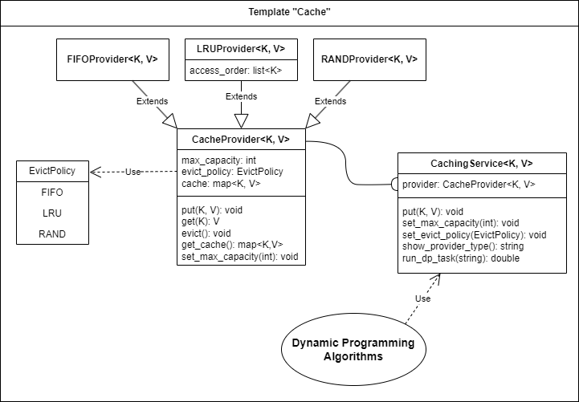

# Шаблон «Кэш объектов»

Кэширование промежуточных решений

Разработать класс – кэш объектов с возможностью изменения размера кэша, сбора статистики и применения различных 
стратегий вытеснения (FIFO, LRU, RAND). В качестве кэша использовать хеш-таблицу с ключом соответствующего типа. 
Использовать при решении одной из задач динамического программирования – поиска оптимального решения на основе 
комбинаторного перебора с кэшированием промежуточных решений.

При чтении очередного слова проверяется его наличие в кэше. При отсутствии производится замещение. 
Для выбранного файла строится зависимость доли попадания в кэш в зависимости от размера кэша и способа вытеснения. 
Сравнить результаты для файлов с разным содержимым -  художественное произведение, технический текст.

